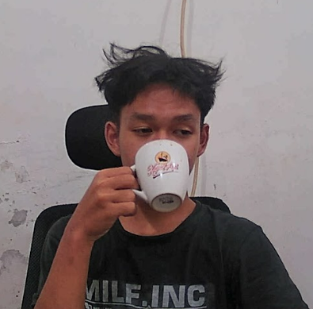

<h1 align="center"><i>Welcome to my page</i></h1>

👀 About me : 
 
<i><b>"just living, not entertaining"<b/></i>
 

 
👋 My name is Muhammad Arsa Prayata
 
🤓 Student from SMKN 1 CIANJUR
 
💬 Ask me about: Anime.
 
⚡ Fun fact I'm funny <b>maybe</b>

  
 

<h3 align="center">📝 Languages and Tools:</h3>

     

 
 

<i>"It doesn't matter how it's done" -Ayanokoji Kiyotaka</i>

 

 
 

<footer>

<i>🔗 Connect with me: 
</i>

</footer>
